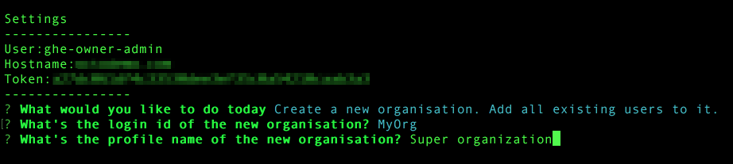

### GitHub Enterprise scripts

This is a collection of scripts to automate GitHub Enterprise workflows using the GitHub Enterprise API. 



#### Use cases

1. Create a user. Add it to `<teamName>` in all instance organizations
2. Create an Org. Create a team `<teamName>` in the Org with Push and Pull rights. Add all users to this new team.

#### Requirements

To run scripts (1) and (2) you'll need:
 - a site admin account (GHE_ADMIN environment variable)
 - a [personal access token](personal access token) (GHE_TOKEN) with scope `admin:org` 
 
The site admin still needs to be an owner of each organisation for the scripts to be effective across the whole instance. The easiest way to achieve this is to run [`ghe-org-owner-promote -u <admin-username>`](https://help.github.com/enterprise/2.3/admin/articles/command-line-utilities/#ghe-org-owner-promote) on the VM command line. You can also do it manually but that can be a tedious job if your instance has too many Orgs.

#### Usage

The script requires 3 variables:
 - `-h` hostname: `-h yourGitHubEnterpriseDomain.net`
 - Environment variable GHE_USER or `-u` option
 - Environment variable GHE_TOKEN or `-t` option
 
Using `-u` or `-t` overrides the ENV variables.

```bash
./github.js -h yourGitHubEnterpriseDomain.net
```

If you've setup your environment variables you should be good to go, otherwise set them inline with option `-u` and `-t`

#### Contributing

This is a simple project with no build. Simply:

```bash
git clone <repo or fork>
npm install
```

If you want to test [octokat.js](https://github.com/philschatz/octokat.js) calls with a minimum rig, run `node` and paste this line in:

`var Octokat = require('octokat'); octo = new Octokat({ username: process.env.GITHUB_USER , password: process.env.GITHUB_TOKEN,rootURL: 'https://yourghedomain.com/api/v3'});var cb = function (err, val) { console.log(val); };
`

Then you can run quick test queries like:

`octo.me.fetch(cb)`